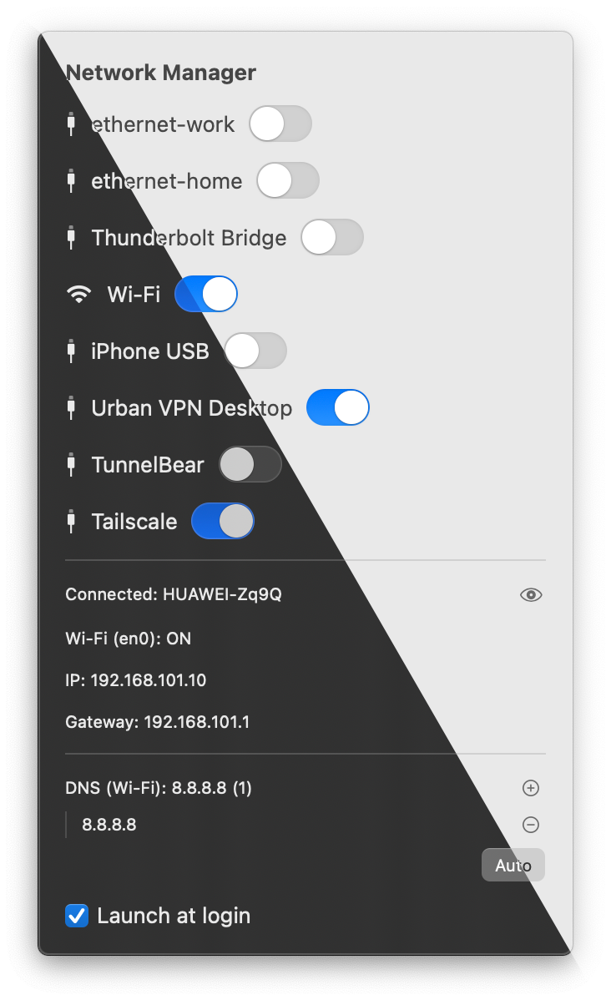

# Network Manager

A native Swift menu-bar app for macOS 13+ (SwiftUI, `MenuBarExtra`). Dynamic status-bar icon (Wi-Fi / Ethernet), popover window with toggles for every network service plus live status (IP, gateway, DNS, connection state).

<p align="center">
  
</p>

---

## Quick Start: From Source to Running App

### 1. Requirements
- macOS 13+ (tested on Sequoia 15.x)
- Full Xcode 15.x or 16.x (not just Command Line Tools)
- Verify: `xcodebuild -version` — **Xcode 26.x on Sequoia does not work** (broken plugins)

### 2. Select Xcode
```bash
sudo xcode-select --switch /Applications/Xcode.app/Contents/Developer
sudo xcodebuild -license accept
xcodebuild -runFirstLaunch
```

### 3. Build, Install to `/Applications`, and Launch
```bash
./scripts/build-and-deploy.sh --run
```
Flags: `--clean` = clean build; omit `--run` to only build and copy.
Or manually: `open NetworkManager.xcodeproj`, select **NetworkManager** scheme, `⌘R`.

### 4. Enable Passwordless (one-time)
Click **Enable passwordless** in the popover (single system prompt; script must be in the app bundle Resources — see below), or from Terminal:
```bash
sudo ./scripts/install-passwordless-sudo.sh
```
After this, all toggles work without password prompts. To revert:
```bash
sudo rm /etc/sudoers.d/network-manager
```

### 5. Use It
- Enable one service — other non-VPN services turn off automatically (exclusive mode)
- VPN services (name contains "vpn") are never touched
- Bottom status shows IP, gateway, and DNS of the active service
- Right-click the menu-bar icon → Quit

---

## Features

- Lists all network services (`networksetup -listallnetworkservices`), each with its own on/off toggle
- **Exclusive mode**: enabling one non-VPN service disables the others; VPN services are ignored
- **Wi-Fi service**: also controls the radio (`setairportpower`); macOS auto-joins known networks
- Live status: IP (Wi-Fi or active wired), default gateway, DNS of active service, SSID/connection state
- **Passwordless**: one-time sudoers allowlist → `sudo -n` without prompts; without allowlist falls back to osascript prompt

---

## Commands Used

### Read-only (no privileges)
| Command | Purpose |
|---------|---------|
| `networksetup -listallnetworkservices` | All services (including disabled) |
| `networksetup -getnetworkserviceenabled <service>` | Check enabled state |
| `networksetup -listallhardwareports` | Find Wi-Fi device (usually `en0`) |
| `networksetup -getairportpower <device>` | Wi-Fi radio state |
| `networksetup -getdnsservers <service>` | DNS servers |
| `networksetup -getinfo <service>` | IP address |
| `/sbin/route -n get default` | Default gateway |
| `/sbin/netstat` | Active connections |

### Privileged (via `sudo -n` with allowlist, else osascript prompt)
| Command | Purpose |
|---------|---------|
| `networksetup -setnetworkserviceenabled <service> on\|off` | Toggle service |
| `networksetup -setairportpower <device> on\|off` | Toggle Wi-Fi radio |
| `dscacheutil -flushcache` | Flush DNS cache |
| `killall -HUP mDNSResponder` | Restart mDNSResponder |

---

## Passwordless (One Password Forever)

The app uses a sudoers allowlist — the GUI **never runs as root**, and **SMJobBless is not used**.

### Enable
1. **Enable passwordless** button in the popover (next to Quit) — one system prompt, then zero prompts. Button hides itself when active (checked via `sudo -n -l` on every refresh).
2. Or manually: `sudo ./scripts/install-passwordless-sudo.sh`

### What's Written to sudoers
File: `/etc/sudoers.d/network-manager` (mode `0440`, validated via `visudo -cf`):
```
%admin ALL=(root) NOPASSWD: /usr/sbin/networksetup -setairportpower *, /usr/sbin/networksetup -setnetworkserviceenabled *, /usr/sbin/networksetup -setdnsservers *, /usr/bin/dscacheutil -flushcache, /usr/bin/killall -HUP mDNSResponder
```

### How It Works
`runPrivilegedBin` executes the target binary directly via `sudo -n <binary> <args>` — no `sh` intermediary (sudoers matches the executed binary, not the shell). Without the allowlist it falls back to an osascript prompt.

### Revert
```bash
sudo rm /etc/sudoers.d/network-manager
```

### Build Note
`scripts/install-passwordless-sudo.sh` **must be copied into the app bundle Resources** (the button looks it up via `Bundle.main.resourcePath`). The `.pbxproj` isn't auto-patched — add it manually in Xcode:
**Target → Build Phases → Copy Files (Destination: Resources, Subpath: empty) → + → `scripts/install-passwordless-sudo.sh`**

---

## Build Details

- Requires full Xcode (not just Command Line Tools), macOS 13+ SDK
- Ad-hoc signing (`CODE_SIGN_IDENTITY = "-"`) — no team needed
- **No Sandbox** (would block `networksetup` / `osascript`)
- `NSAppleEventsUsageDescription` in `Info.plist` (for osascript fallback)
- `LSUIElement = true` — menu-bar only, no Dock icon
- Right-click on status icon → Quit (AppDelegate + local right-click monitor on our status item only; left click and popover untouched)

---

## Project Structure

| File | Role |
|------|------|
| `NetworkManager/NetworkManagerApp.swift` | `@main` App, `MenuBarExtra` + AppDelegate (right-click → Quit) |
| `NetworkManager/ContentView.swift` | Service list with toggles, status (IP/gateway/DNS/Connected), Enable passwordless, Quit |
| `NetworkManager/NetworkManager.swift` | Wrapper around `networksetup`/`route`/`netstat`: reads without privileges, writes via `sudo -n` with osascript fallback |
| `NetworkManager/Info.plist` | `LSUIElement`, `NSAppleEventsUsageDescription` |
| `scripts/build-and-deploy.sh` | Release build + install to `/Applications` (`--run` to launch, `--clean` for clean build) |
| `scripts/install-passwordless-sudo.sh` | Installs the sudoers allowlist (one password prompt) |

